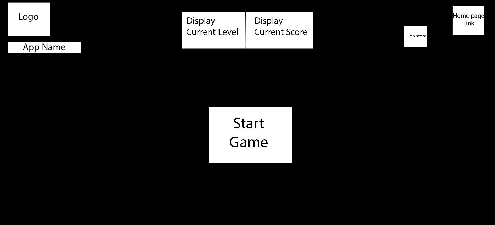
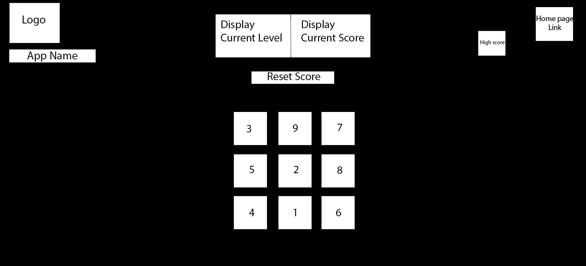
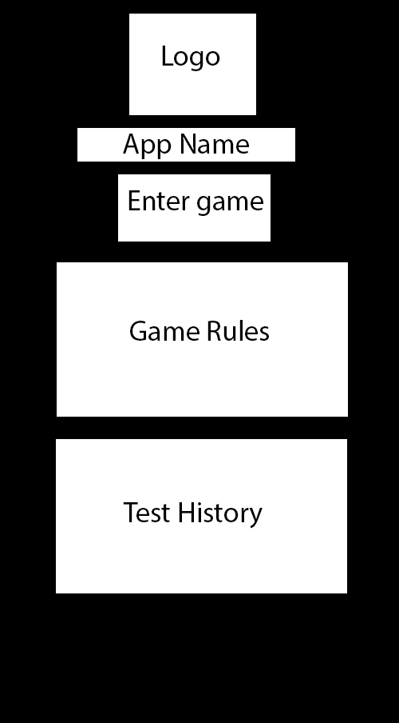

## Interactive Frontend Development Project - Code Institute
---
# Ape Index
Ape Index is based on tests conducted on apes by Dr. Matsuzawaat at the Kyoto University in Japan. He found that the average ape can outperform or at least match most humans on a short term memory test where the participant must memorize the positions of numbers on a screen. 

This app is a gamified version of that test. The user can test their memory by working up through the levels and eventually attempt the test at the level the apes did.

This app is for science enthusiasts and people that want to exercise their memory by playing a game. 

#### The game is hosted here [here](https://gerard-mc.github.io/http-Gerard-Mc.github.io./)

---
## Summary
* [User Experience](#ux)
    * [User Stories](#user-stories)
    * [Five planes](#strategy)
* [Features](#features)
    * [Existing Features](#existing-features)
    * [Future Features](#future-features)
* [Technology used](#technology-used)
* [Testing](#testing)
* [Deployment](#deployment)
* [Credits](#credits)
---
### Project Goals
#### Target Audience
- People who are generally interested in science
- People interested in primates
- People who are interested in the brain/cognition/memory
- People looking to exercise their memory
- People looking to kill some time playing a game
- People that are interested in the particular experiment that the game is based on

#### Visitor/user goals:
- Play the game
- Gain information on the experiment
- Experience the experiment

#### Business goals(site owner's goals):
- Provide the users with a fun and challenging experience
- Promote science and research
---
## UX

The Game is a memory game or mini science experiment, depending on the user. The user has a place to go after reading about the experiment and would like to learn more and test their memory against the apes. This is also a fun memory game for brain training enthusiasts.

The game is designed in a way that lets the user progress through less challenging levels, but remaining stimulating and storing their level progress, allowing for multiple attempts at any given level. The game gives the motivation to continue because the last level is more like the real experiment regarding time. 

The user can play the game for a while, close the browser, and then return to play some more at the level they left at, eliminating the frustration of starting over, but also giving the option to start from level 1 whenever they wish.

[Back to top](#summary)
## UX
### User Stories
As a new user of the web-site, I would like to be able to:

* **Learn**
  - Learn about the original experiment. 

  

* **Train Memory**
  - Practise using my memory by using a game.

  

* **Progress**
  - Save my progression and play again from my previously achieved level.

  

* **Start Over**
  - Clear my score if I want to start again.

  

* **Test Myself**
  - Test myself against a famous science experiment and have proof I succeeded.

  

* **Play on mobile**
  - Play the game anywhere I want.

  

### New users
 - Gain info and/or get to the game quikly
### Returning Users
 - Keep previous scores and get to the game quickly

[Back to top](#summary)

### Strategy
Ape Index is a two page website. An info page and a game page. It is a game that can allow a user to replicate an experiment, learn about how ape cognition can beat human in this circumstance, play a game for fun, or engage in a memory exercise.

The means the user goals will be simple--learn about the experiment or play game, so this is what it aims to provide.

### Scope

The scope of the project will be a simple website, with some info and game instructions, that directs the user to the game. The game will have increasing difficulty levels up to a point, and will track and store the high scores of the user. It will provide guidance on when the game will start and what to expect. It will be single player, but in the future it would be a nice feature to let users battle each over by linking their scores to each others app remotely.

### Structure

The user will arrive at the hompage that will have a "Play Now" call to action button clearly visible in case they want to skip the info and go right to the game.
For first time players, a game rules section will be in view under the header as a signpost letting them now the info is right there. 
Below the rules, there is an info section with text briefly filling them in on the experiment and its outcome. In this section there is a video providing footage of an ape playing the game and further information about it. Below this section is another CTA button to aid them on getting to the game quickly if they wish.

The game itself is conventional in its layout; a hub for scores and navigation on top, and the game area below this. The color scheme is of high contrast to reduce distraction while the game is played. The player will have a couple of options availible to them: Start the game, Return to hompage, and reset the scores.

* **Learn**
  - Learn about the original experiment. 

  

* **Train Memory**
  - Practise using my memory by using a game.

  

* **Progress**
  - Save my progression and play again from my previously achieved level.

  

* **Start Over**
  - Clear my score if I want to start again.

  

* **Test Myself**
  - Test myself against a famous science experiment and have proof I succeeded.

  

* **Play on mobile**
  - Play the game anywhere I want.

  

### Wireframes
* **Homepage Large Screens**

  

* **Homepage Large Pre-game**

  

* **Homepage Large In-game**

  

* **Homepage Mobile Screen**

  

* **Homepage Mobile Pre-game**

  

* **Mobile In-game**

  

[Back to top](#summary)

---
## Features
### Existing Features
#### Homepage

* "Play" Button links
  - Serves as a gateway to the gamescreen

* Game Rules section

  - Gives info on what to expect when playing the game

* Info Text

  - Brief reading about the original tests done by scientists.

  * Info Video

  - Brief video about the original tests.

#### Game Page

* "Start" Button 
  - Begins the game. Tells the player how many seconds they have to memorize the board and then counts down from 3.

* Boxes with random numbers

  - The boxes are timed to display after the countdown has disapeared. Each time they load they will be assigned a random number from 1 - 9. The numbers disapeer, and if the user taps the lowest number 1st and so on, the boxes disapeer. If the user taps the wrong box, they all disapeer and the start button reapears.

* Return Button

  - Links back to the homepage

  * Score Element

  - Displays the current game's score

  * Level Element

  - Displays the current game's level

   * Level Element

  - Displays the users record level score. Stored in local storage.

[Back to top](#summary)

### Future Features
  - It would be good to let players link their apps and challenge each other. Also let people post their scores on social media.
  Visual and sound effects would make the game more stimulating and provide the user with feedback.

[Back to top](#summary)

---

## Technology used

* HTML5
    - https://en.wikipedia.org/wiki/HTML5

* CCS3
    - https://en.wikipedia.org/wiki/Cascading_Style_Sheets

* JavaScript
    - https://www.javascript.com/

* Fontawesome
    - https://fontawesome.com/

* Google fonts
    - https://fonts.google.com/

* Fontawesome
    - https://fontawesome.com/

* Gitpod
    - https://gitpod.io/

* GitHub
    - https://github.com/

[Back to top](#summary)

---

## Testing
This site was tested with Google Chrome, Mozzila Firefox and MS Edge, almost all devices on Chrome dev tools and showed no alignment issues at conventional screen values. Most devices were fine in chrome tools. Some future styling will be needed for maximum compatibility.
responsivness and compatibility. Also manually resizing the browser and viewing the breakpoints was used in the dev tools option to find faults.
[Some Breakpoint tests](testing/javascript/)

The Javascript was mostly tested by using breakpoints in the dev tools and watching the output. Eg, when something was sopposed to be processed but be invisable, I could go to source file script.js, set breakpoints, watch the program go through the breakpoints and see the output in the elements tabs.
[Some Example JS tests](testing/breakpoints/)

### Improvements to be made
Some further media queries to be made for maximum compatibility across most devices;
An error I missed too late, when a box is tapped and becomes invisible, if tapped again the game registers it as an incorrect answer and ends the game. This would be fixed by using display: instead of invisibility, but time has ran out. 

### Additional manual testing
* All features were used several times to see if the expected outcome occured. If there was a problem I either used console.log() or breakpoints to see what was going on 

### Validating code
HTML
 - [W3 validator](https://validator.w3.org/).

CSS
 -  [W3 Jigsaw](https://jigsaw.w3.org/css-validator/).

JS
 -  [JS Hint](https://jshint.com/).

 All HTML, CSS, JavaScript were validated using the links above.

 [Back to top](#summary)

---

## Deployment
This site is hosted using GitHub pages. 

### Deployment process: 
  - Login into your GitHub account.
  - Click your orofile and go to my repositories.
  - Choose the repository you wish to deploy.
  - Go to settings and go down to GitHub Pages.
  - Scroll down to Github pages
  - Select master branch.
  - Save
  - Your website link will be there saved in the settings of your repository 

### Run Locally: 
Clone this repository directly into the editor of your choice by pasting `git clone https://github.com/URL-TO-REPO-HERE` in the terminal. 

Please click [here](https://help.github.com/en/github/creating-cloning-and-archiving-repositories/cloning-a-repository) for further help

[Back to top](#summary)

---
## Credits
### Content
+ 

### Media
+ Images were taken from Getty Images

### Acknowledgement
* My mentor, for teaching me the conventional way of building an app from JavaScript.
* CodeInstitute for their great content.
* W3 Schools and Khan Academy, both exellent resources for beginer coders.
 

[Back to top](#summary)